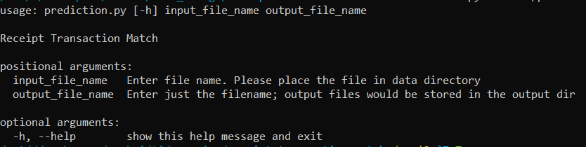

**receipt-transaction-match**

To run the model and get the final predictions, we can run `prediction.py`
 
About prediction.py

Commands for running `prediction.py` 
`python src/prediction.py --help`
 `python src/prediction.py test_sample.csv output_08_19.csv`

  Input files should be placed in data directory and input file structure should be same as sample file given (csv, : separated). 
  Output files would be generated in output directory
  Saved models are stored in models directory

Code files
> *train.ipynb* - Data preprocessing, Modelling, Ranking, Evaluation
> 
> *prediction.py* - Code to run the saved models for the final ranks
> 
>*utils.py* - Function to determine rank from probabilities

